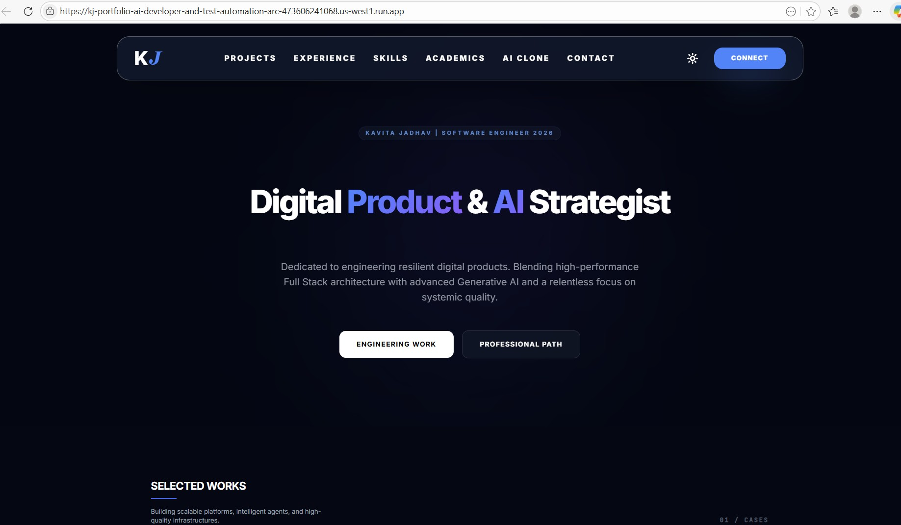

# Kavita Jadhav | Full Stack & AI Developer Portfolio

This is a high-end, interactive portfolio site featuring a digital AI twin, dynamic project filtering, and a modern "Glassmorphism" aesthetic.

## 🚀 Features
- **AI Digital Twin:** Interactive chat powered by Google Gemini (Gemini 3 Pro) trained on my engineering philosophy.
- **Dynamic Projects:** Categorized showcase of Full Stack, AI, and Test Automation work.
- **Modern Stack:** React 19, Tailwind CSS, TypeScript, and Google GenAI SDK.
- **CI/CD Ready:** Pre-configured GitHub Actions for deployment to Google Cloud Run.

## 🛠️ Local Setup

1. **Install Dependencies:**
   ```bash
   npm install
   ```

2. **Set API Key:**
   Create a `.env` file (or export in terminal):
   ```bash
   export API_KEY="your_gemini_api_key"
   ```

3. **Run Development Server:**
   ```bash
   npm run dev
   ```


## 🌐 Live Demo

- **GCP Cloud Run:** [https://kj-portfolio-ai-developer-and-test-automation-arc-473606241068.us-west1.run.app/](https://kj-portfolio-ai-developer-and-test-automation-arc-473606241068.us-west1.run.app/)

- **Vercel:** [https://kavita-jadhav-portfolio-app.vercel.app/](https://kavita-jadhav-portfolio-app.vercel.app/)

- **Dev Post (Portfolio Challenge):** [AI-Powered Portfolio: Full Stack Developer Showcase with Google Gemini & Cloud Run](https://dev.to/kavitaj11/ai-powered-portfolio-full-stack-developer-showcase-with-google-gemini-cloud-run-2aaj)

## ☁️ Deployment & Docs
This project is configured for **Google Cloud Run** via Workload Identity Federation. See [project documentation](docs/README.md) for deployment and submission guides.

## 📄 License
MIT

## 📬 Contact

For consulting, training, or implementation support:  
🔗 [k11softwaresolutions.com](https://www.k11softwaresolutions.com)  
📧 k11softwaresolutions@outlook.com